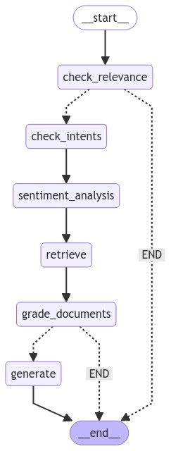

# LangGraph Chatbot Flow

This project implements a LangGraph-based chatbot designed to handle user queries with a sophisticated workflow involving multiple components such as intent classification, sentiment analysis, query retrieval, and document grading. The flow is organized to ensure that the chatbot provides relevant and accurate responses to user queries.

## Workflow Overview

The chatbot workflow is structured as follows:

1. **Check Relevance**: The flow begins with evaluating the relevance of the incoming query. If the query is deemed irrelevant to the system's domain, the process ends here. Otherwise, it proceeds to the next step.

2. **Check Intents**: If the query is relevant, the next step involves determining the user's intent using an intent classifier. This step helps in understanding what the user is trying to achieve with their query.

3. **Sentiment Analysis**: After identifying the intent, the system performs sentiment analysis on the query. This step gauges the emotional tone of the user’s input, which can be used to influence the response more effectively.

4. **Retrieve**: Based on the analyzed intent and sentiment, the system attempts to retrieve relevant documents or information that can help address the query.

5. **Grade Documents**: The retrieved documents are then graded for their relevance and quality. This step ensures that the most appropriate information is selected for the final response.

6. **Generate**: Finally, the chatbot generates a response based on the graded documents and the analysis performed in the earlier steps. This response is then delivered to the user.

7. **End**: The flow concludes, having either responded to the query or determined that the query was not relevant.

## Key Components

### 1. Query Grader
The Query Grader is responsible for evaluating the quality and relevance of retrieved documents. It assigns a grade to each document, ensuring that only the most relevant information is used in generating a response.

### 2. Sentiment Analyzer
The Sentiment Analyzer assesses the emotional tone of the user’s query. It categorizes the sentiment as positive, negative, or neutral, which helps in tailoring the chatbot’s response to be more aligned with the user’s tone.

### 3. Intent Classifier
The Intent Classifier determines the user's intent based on their query. It categorizes the query into predefined intents, which directs the chatbot's subsequent actions and retrieval process.

### 4. Retrieval Grader
The Retrieval Grader is used after the retrieval process to ensure that the most relevant documents are chosen for response generation. It further filters and prioritizes the retrieved content.

## Flow Diagram

The following flowchart illustrates the entire process:

